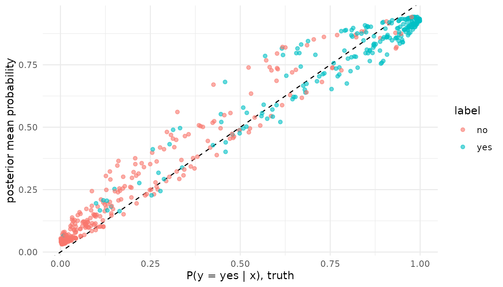

# Binary AddiVortes: probit classification

## Introduction

Binary AddiVortes is the classification variant of Stone and Gosling
(2025): the probability of the positive label is a probit function of
the sum of tessellations, fitted with the latent-variable augmentation
of Albert and Chib (1993), as BART’s `pbart` fits its probit model. A
two-level factor response selects it, or
[`probit_outcome()`](https://l-thomson.github.io/thiessen/r/reference/probit_outcome.md)
names it. Reach for it where you would reach for `pbart`: a binary
outcome whose probability is a nonlinear function of the covariates.

## Likelihood

    y_i in {0, 1},   P(y_i = 1 | x_i) = Phi(c + f(x_i))

with Phi the standard normal distribution function, c an offset and f
the sum of tessellations. The sampler draws a latent z_i ~ N(c + f(x_i),
1), truncated to the side its label demands, before each sweep, and
updates the ensemble as in the Gaussian model with z - c as the response
and unit variance.

## Priors

- Cell values mu ~ N(0, sigma_mu^2) with sigma_mu = 3 / (k sqrt(m)) on
  the latent scale, so the prior on f(x) puts most of its mass on \[-3,
  3\] (Chipman, George and McCulloch 2010, s. 4; `term_params(k = 3)`).
- The cell-count, covariate-inclusion and centre priors of the Gaussian
  model, unchanged.

Fixed: the latent variance is 1, since a probit model does not identify
it, so no sigma is drawn. The offset c is `probit_outcome(offset = )`
and resolves to Phi^-1(ybar) at fit, the BART `binaryOffset` default.

## Posterior

[`predict()`](https://rdrr.io/r/stats/predict.html) gives the posterior
mean probability of the second level; `interval = "credible"` an
interval on the probability scale; `type = "latent"` the per-draw latent
mean c + f(x).
[`log_lik()`](https://mc-stan.org/rstantools/reference/log_lik.html) is
the Bernoulli log-likelihood,
[`posterior_predict()`](https://mc-stan.org/rstantools/reference/posterior_predict.html)
draws labels, and `fit$in_sample_rmse` is the root Brier score.
[`sigma()`](https://rdrr.io/r/stats/sigma.html) is 1, a variance
ensemble is not available, and `predict(interval = "prediction")`
errors: a two-point distribution has no continuous predictive interval.

## Example

The truth is a probability surface over two covariates, steep across a
boundary oblique to both axes; labels are drawn from it.

``` r

library(thiessen)
library(ggplot2)

set.seed(1)
probability <- function(x) pnorm(5 * (x[, 1] + 0.3 * x[, 2] - 0.65))
draw <- function(n) {
  x <- cbind(a = runif(n), b = runif(n))
  p <- probability(x)
  list(x = x, p = p, label = factor(rbinom(n, 1, p), labels = c("no", "yes")))
}
train <- draw(300)
test <- draw(500)

fit <- thiessen(train$x, train$label, seed = 1)
fit
#> AddiVortes fit
#> Call: thiessen(x = train$x, y = train$label, seed = 1)
#> probit model, 300 observations, 2 covariates
#> 200 tessellations, 4000 draws kept after 200 burn-in, thinning 1
#> In-sample RMSE 0.3421, seed 1
#> 4 chains, largest R-hat 1.003, smallest effective sample size 1223
```

A two-level factor response becomes 0 and 1 with the first level as the
zero, as [`glm()`](https://rdrr.io/r/stats/glm.html) treats one; the
levels are kept on the fit.
[`predict()`](https://rdrr.io/r/stats/predict.html) returns the
probability of the second level, “yes”:

``` r

estimate <- predict(fit, test$x, interval = "credible", level = 0.9)
head(estimate, 3)
#>            fit     lower     upper
#> [1,] 0.9213925 0.8027950 0.9873848
#> [2,] 0.8460816 0.6844747 0.9559514
#> [3,] 0.3686573 0.1582539 0.6148573
```

Against the truth on the held-out rows: the root mean squared error of
the probability, the accuracy at 0.5, and the coverage of the 90 per
cent credible interval.

``` r

data.frame(
  rmse = sqrt(mean((estimate[, "fit"] - test$p)^2)),
  accuracy = mean((estimate[, "fit"] > 0.5) == (test$label == "yes")),
  coverage = mean(test$p >= estimate[, "lower"] & test$p <= estimate[, "upper"])
)
#>         rmse accuracy coverage
#> 1 0.07440236    0.848    0.906
```

The figure plots the estimated probability against the true one for the
held-out rows, coloured by the label that was drawn.

``` r

ggplot(data.frame(truth = test$p, estimate, label = test$label),
       aes(truth, fit, colour = label)) +
  geom_abline(linetype = "dashed") +
  geom_point(alpha = 0.6) +
  labs(x = "P(y = yes | x), truth", y = "posterior mean probability")
```



## References

Albert, J. H. and Chib, S. (1993). Bayesian analysis of binary and
polychotomous response data. *Journal of the American Statistical
Association* 88(422), 669-679. <doi:10.1080/01621459.1993.10476321>

Chipman, H. A., George, E. I. and McCulloch, R. E. (2010). BART:
Bayesian additive regression trees. *The Annals of Applied Statistics*
4(1), 266-298. <doi:10.1214/09-AOAS285>

Stone, A. and Gosling, J. P. (2025). AddiVortes: (Bayesian) additive
Voronoi tessellations. *Journal of Computational and Graphical
Statistics* 34(3), 859-871. <doi:10.1080/10618600.2024.2414104>
