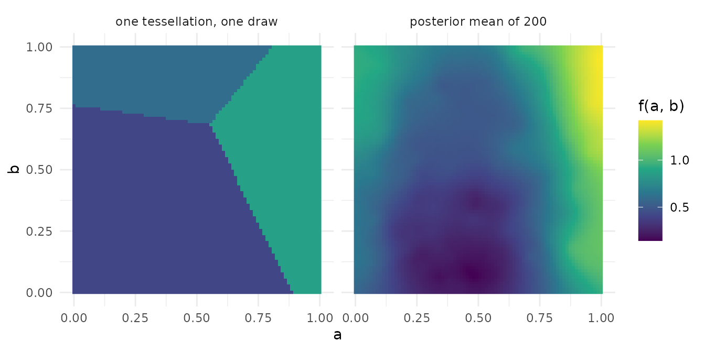

# Covariates and the covariate space

A tessellation partitions the covariate space by distance to its
centres, so what a covariate is, how it is scaled and how distance is
measured on it decide the shape of every cell. This page covers the
three ways data enter a fit, the encoding of factors, the scaling the
sampler applies, and the two non-Euclidean metrics of the published
method, with one figure of what a tessellation looks like.

``` r

library(thiessen)
library(ggplot2)

set.seed(1)
n <- 200
d <- data.frame(
  a = runif(n), b = runif(n),
  g = factor(sample(c("low", "mid", "high"), n, replace = TRUE))
)
d$y <- 3 * (d$a - 0.4)^2 + 0.5 * d$b + 0.3 * (d$g == "high") +
  rnorm(n, sd = 0.1)
control <- thiessen_control()
```

## Three ways in

A formula and a data frame, a data frame and a response, or a numeric
matrix and a response. The first two go through hardhat, so
`predict(newdata = )` matches columns by name and type and reports a
missing one; the matrix method takes a matrix with the fitted columns.

``` r

by_formula <- thiessen(y ~ a + b + g, d, control, seed = 1)
by_frame <- thiessen(d[c("a", "b", "g")], d$y, control, seed = 1)
by_matrix <- thiessen(model.matrix(~ a + b + g, d)[, -1], d$y, control,
                      seed = 1)

identical(predict(by_formula, d), predict(by_frame, d))
#> [1] TRUE
```

The formula and data frame fits are the same fit. The matrix fit is the
same model on the same design,
[`model.matrix()`](https://rdrr.io/r/stats/model.matrix.html) without
its intercept, and the columns show the encoding:

``` r

colnames(by_matrix$x)
#> [1] "a"    "b"    "glow" "gmid"
```

A column the new data lack is an error naming it:

``` r

predict(by_formula, d[c("a", "g")])
#> Error in `predict()`:
#> ! The required column "b" is missing.
```

## Factors

A factor covariate becomes d - 1 treatment-contrast indicators, the
first level as reference, as
[`model.matrix()`](https://rdrr.io/r/stats/model.matrix.html) and CRAN
AddiVortes encode one. Each indicator is then a Euclidean column, so a
tessellation can split on it, and the levels are ordered by nothing. A
two-level factor response selects the probit model; an ordered factor
selects the ordinal model, which needs the [experimental
build](https://l-thomson.github.io/thiessen/r/articles/experimental.md).

The alternative is to declare a `metric`, one entry per column, and mark
the factor `"categorical"`: the column then passes as integer level
codes and the distance on it is the mismatch weight of Eskin and others
(2002), 2 / L^2 per mismatching column for L levels, so every level is
equally far from every other. With a declared metric, every factor
column must be declared categorical. This fit and the spherical one
below take 2000 draws per chain, which they need to pass the convergence
check; the [chains and
convergence](https://l-thomson.github.io/thiessen/r/articles/convergence.md)
page says why.

``` r

categorical <- thiessen_control(
  general_params = general_params(draws = 2000),
  mean_params = term_params(
    geometry = geometry_params(metric = list("euclidean", "euclidean",
                                             "categorical"))
  )
)
by_code <- thiessen(y ~ a + b + g, d, categorical, seed = 1)
c(indicators = ncol(by_formula$x), codes = ncol(by_code$x))
#> indicators      codes 
#>          4          3
c(indicators = sqrt(mean(residuals(by_formula)^2)),
  codes = sqrt(mean(residuals(by_code)^2)))
#> indicators      codes 
#> 0.06568429 0.05598384
```

## Scaling

Pass raw data. Inside the sampler a Euclidean column is min-max scaled
to \[-0.5, 0.5\] over its training range, which is what makes one
distance comparable across columns of different units; the fit is
invariant to the units the covariates arrive in.

``` r

rescaled <- d
rescaled$a <- 1000 * rescaled$a
all.equal(predict(thiessen(y ~ a + b + g, rescaled, control, seed = 1),
                  rescaled),
          predict(by_formula, d))
#> [1] TRUE
```

The centre-proposal scale `sigma_c` is on that internal scale, so
`sigma_c = 1` is the full training range of a Euclidean column. A
categorical column and a spherical one are not scaled.

## Coordinates on a sphere

Latitude and longitude are one covariate, not two: distance between two
points is the great-circle angle. The published method declares such
columns as one sphere, `list(spherical = list(sphere = 1))` on each,
latitudes first and the longitude last, in radians. The response below
depends on latitude alone.

``` r

latitude <- runif(n, -pi / 2, pi / 2)
longitude <- runif(n, -pi, pi)
z <- sin(latitude) + rnorm(n, sd = 0.1)

spherical <- thiessen_control(
  general_params = general_params(draws = 2000),
  mean_params = term_params(
    geometry = geometry_params(metric = list(
      list(spherical = list(sphere = 1)), list(spherical = list(sphere = 1))
    ))
  )
)
on_sphere <- thiessen(cbind(latitude, longitude), z, spherical, seed = 1)
sqrt(mean(residuals(on_sphere)^2))
#> [1] 0.03596107
```

Two points at the same latitude on opposite sides of the date line are
neighbours under this metric, and would be far apart under the Euclidean
one.

## What a tessellation looks like

A one-tessellation fit on the two numeric covariates, read at one kept
draw over a grid, shows the partition the method is built from: a
handful of Voronoi cells, each with one value. The posterior mean of a
full ensemble on the same two covariates, right, is the sum of two
hundred such partitions averaged over the draws, and is smooth.

``` r

grid <- as.matrix(expand.grid(a = seq(0, 1, length.out = 80),
                              b = seq(0, 1, length.out = 80)))
xy <- as.matrix(d[c("a", "b")])
one <- thiessen(xy, d$y, thiessen_control(
  tessellations = 1, general_params = general_params(burn_in = 100, draws = 1)
), seed = 1, chains = 1)
ensemble <- thiessen(xy, d$y, seed = 1)

surfaces <- rbind(
  data.frame(grid, f = predict(one, grid, type = "draws")[1, ],
             which = "one tessellation, one draw"),
  data.frame(grid, f = predict(ensemble, grid),
             which = "posterior mean of 200")
)
ggplot(surfaces, aes(a, b, fill = f)) +
  geom_raster() +
  facet_wrap(~which) +
  coord_equal() +
  scale_fill_viridis_c() +
  labs(fill = "f(a, b)")
```



## References

Eskin, E., Arnold, A., Prerau, M., Portnoy, L. and Stolfo, S. (2002). A
geometric framework for unsupervised anomaly detection. In *Applications
of Data Mining in Computer Security*, 77-101. Springer.

Stone, A. and Gosling, J. P. (2025). AddiVortes: (Bayesian) additive
Voronoi tessellations. *Journal of Computational and Graphical
Statistics* 34(3), 859-871. <doi:10.1080/10618600.2024.2414104>
