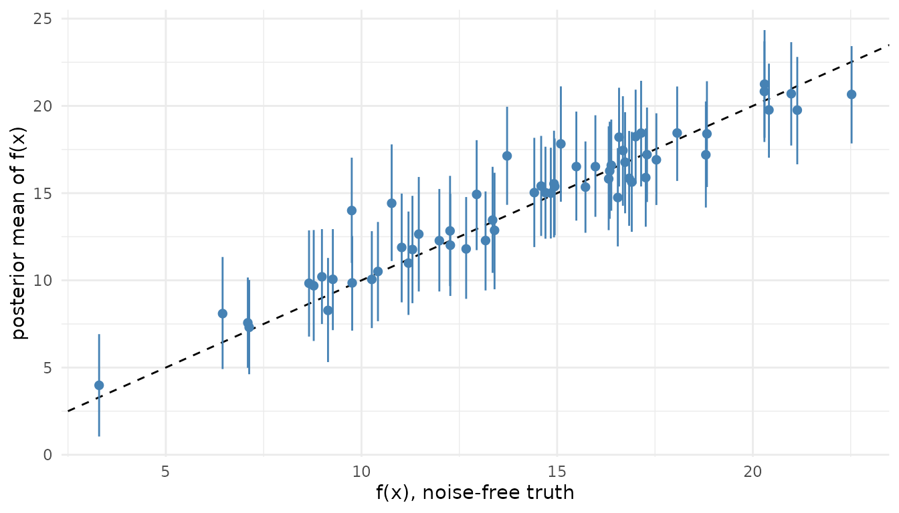

# Gaussian regression

## Introduction

The Gaussian model is AddiVortes as Stone and Gosling (2025) state it: a
continuous response, a mean function that is a sum of Voronoi
tessellations, and one residual variance. It is the model
[`thiessen()`](https://l-thomson.github.io/thiessen/r/reference/thiessen.md)
fits to a numeric response when nothing else is named, and the default
configuration is the published one. Reach for it where you would reach
for BART’s `wbart`: a nonlinear regression with interactions you do not
want to specify, on tens to thousands of rows.

## Likelihood

    y_i = f(x_i) + e_i,   e_i ~ N(0, sigma^2),   i = 1, ..., n

with f(x) the sum of m tessellations, each a piecewise-constant function
on a Voronoi partition of a random subset of the covariates. The [model
description](https://l-thomson.github.io/thiessen/r/articles/model-description.md)
page states f and the partition in full.

## Priors

- Cell values mu ~ N(0, sigma_mu^2) with sigma_mu = 0.5 / (k sqrt(m)) on
  the response scaled to \[-0.5, 0.5\], so the prior on f(x) puts most
  of its mass across the range of the data (`term_params(k = 3)`).
- Residual variance sigma^2 ~ nu lambda / chi^2_nu, with lambda set so
  that Pr(sigma \< sigma_hat) = q for sigma_hat the residual standard
  deviation of a least-squares fit
  (`gaussian_outcome(nu = 6, q = 0.85)`).
- Cells per tessellation b - 1 ~ Poisson(lambda_c)
  (`term_params(lambda_c = 5)`); active covariates d - 1 ~ Binomial(p -
  1, omega / p) (`structure_params(omega = min(3, p))`); centre
  coordinates N(0, sigma_c^2) on the scaled covariates
  (`geometry_params(sigma_c = 0.8)`).

Nothing is fixed: every quantity above is sampled or set by the data.
The [priors](https://l-thomson.github.io/thiessen/r/articles/priors.md)
page draws from each of them.

## Posterior

A fit carries the kept draws of every chain.
[`predict()`](https://rdrr.io/r/stats/predict.html) gives the posterior
mean of f(x), a credible interval for it, or a predictive interval for a
new observation; `predict(type = "draws")` the per-draw mean function
and `type = "variance"` the per-draw sigma^2;
[`sigma()`](https://rdrr.io/r/stats/sigma.html) the posterior mean of
sigma;
[`log_lik()`](https://mc-stan.org/rstantools/reference/log_lik.html) the
pointwise log-likelihood under N(f_d(x), sigma_d^2) for each draw d; and
[`posterior::as_draws_df()`](https://mc-stan.org/posterior/reference/draws_df.html)
the draws as variables `mu[i]`, `sigma`, `cell_count` and
`dimension_count`.

## Example

Friedman \#1 (Friedman 1991) is the test function the BART papers use:
five informative covariates, five noise, and noise of standard
deviation 1. The truth is known, so the held-out error is measured
against the noise-free function and not against a noisy response.

``` r

library(thiessen)
library(ggplot2)

friedman <- function(n, p = 10, sd = 1) {
  x <- matrix(runif(n * p), n, p, dimnames = list(NULL, paste0("x", 1:p)))
  f <- 10 * sin(pi * x[, 1] * x[, 2]) + 20 * (x[, 3] - 0.5)^2 +
    10 * x[, 4] + 5 * x[, 5]
  list(x = x, f = f, y = f + rnorm(n, sd = sd))
}

set.seed(1)
train <- friedman(200)
test <- friedman(500)
```

The default schedule of 1000 draws per chain is short for this problem:
with p = 10 the effective sample size of the mean function falls below
the threshold of 400 and the fit warns. Three thousand draws per chain
clear it, so that is the one setting changed from the defaults.

``` r

control <- thiessen_control(general_params = general_params(draws = 3000))
fit <- thiessen(train$x, train$y, control, seed = 1)
fit
#> AddiVortes fit
#> Call: thiessen(x = train$x, y = train$y, control = control, seed = 1)
#> gaussian model, 200 observations, 10 covariates
#> 200 tessellations, 12000 draws kept after 200 burn-in, thinning 1
#> In-sample RMSE 0.3409, seed 1
#> 4 chains, largest R-hat 1.006, smallest effective sample size 501
```

[`sigma()`](https://rdrr.io/r/stats/sigma.html) recovers the noise scale
the data were made with:

``` r

sigma(fit)
#> [1] 0.9032808
```

On the held-out rows, the root mean squared error of the posterior mean
against the noise-free truth, the coverage of the 90 per cent credible
interval for f and of the 90 per cent predictive interval for y, and the
mean width of each:

``` r

credible <- predict(fit, test$x, interval = "credible", level = 0.9)
predictive <- predict(fit, test$x, interval = "prediction", level = 0.9)

data.frame(
  rmse = sqrt(mean((credible[, "fit"] - test$f)^2)),
  credible_coverage = mean(test$f >= credible[, "lower"] &
                             test$f <= credible[, "upper"]),
  credible_width = mean(credible[, "upper"] - credible[, "lower"]),
  predictive_coverage = mean(test$y >= predictive[, "lower"] &
                               test$y <= predictive[, "upper"]),
  predictive_width = mean(predictive[, "upper"] - predictive[, "lower"])
)
#>       rmse credible_coverage credible_width predictive_coverage
#> 1 1.364591             0.962       5.852224               0.958
#>   predictive_width
#> 1         6.573157
```

The figure plots the posterior mean against the truth for sixty of the
held-out rows, with the 90 per cent credible interval as the bar.

``` r

shown <- sample(nrow(test$x), 60)
ggplot(data.frame(truth = test$f[shown], credible[shown, ]),
       aes(truth, fit)) +
  geom_abline(linetype = "dashed") +
  geom_pointrange(aes(ymin = lower, ymax = upper), colour = "steelblue",
                  size = 0.3) +
  labs(x = "f(x), noise-free truth", y = "posterior mean of f(x)")
```



[`log_lik()`](https://mc-stan.org/rstantools/reference/log_lik.html) at
new data gives the log predictive density of each held-out observation,
averaged over the draws; its mean over rows is the log score.

``` r

log_likelihood <- log_lik(fit, newdata = test$x, y = test$y)
mean(log(colMeans(exp(log_likelihood))))
#> [1] -1.947139
```

[`variable_inclusion()`](https://l-thomson.github.io/thiessen/r/reference/variable_inclusion.md)
reports where the ensemble spent its dimensions. With p = 10 and `omega`
at its default of 3, each tessellation holds about three covariates, and
the shares separate only weakly from the uniform 0.1: the ensemble
reaches the five informative covariates through many small tessellations
rather than by concentrating on them. Read the shares as where the
dimensions went, not as variable selection:

``` r

round(variable_inclusion(fit), 3)
#>    x1    x2    x3    x4    x5    x6    x7    x8    x9   x10 
#> 0.105 0.105 0.105 0.105 0.100 0.095 0.096 0.097 0.097 0.096
```

## References

Chipman, H. A., George, E. I. and McCulloch, R. E. (2010). BART:
Bayesian additive regression trees. *The Annals of Applied Statistics*
4(1), 266-298. <doi:10.1214/09-AOAS285>

Friedman, J. H. (1991). Multivariate adaptive regression splines. *The
Annals of Statistics* 19(1), 1-67. <doi:10.1214/aos/1176347963>

Stone, A. and Gosling, J. P. (2025). AddiVortes: (Bayesian) additive
Voronoi tessellations. *Journal of Computational and Graphical
Statistics* 34(3), 859-871. <doi:10.1080/10618600.2024.2414104>
