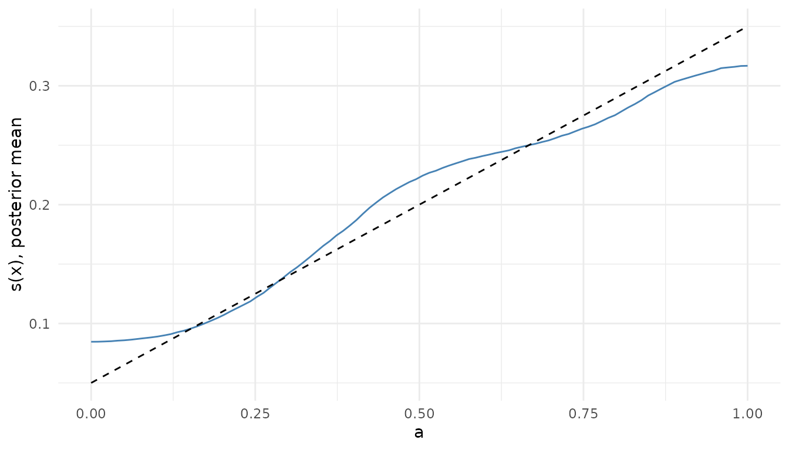

# H-AddiVortes: heteroscedastic regression

## Introduction

H-AddiVortes is the heteroscedastic variant of Stone and Gosling (2025):
the noise variance is itself a function of x, a product of variance
tessellations, with the structure of HBART (Pratola, Chipman, George and
McCulloch, 2020). It is selected by attaching a variance ensemble to the
Gaussian family, a positive tessellation count on `variance_params`; the
paper’s count is 40. Reach for it where the spread of the response
changes across the covariate space and a predictive interval of one
width would be wrong somewhere.

## Likelihood

    y_i = f(x_i) + s(x_i) e_i,   e_i ~ N(0, 1)
    s^2(x) = prod_{j=1}^{m'} v(x; T'_j, V_j)

with f the sum of m mean tessellations and s^2 the product of m’
variance tessellations, v(x; T’, V) the value of the cell of T’ that x
falls in. One sweep updates the variance ensemble given the residuals
y - f, then the mean ensemble with per-observation precision 1 /
s^2(x_i).

## Priors

- Mean cells as in the Gaussian model, mu ~ N(0, sigma_mu^2) with
  sigma_mu = 0.5 / (k sqrt(m)).
- Each variance cell v ~ inverse gamma(nu’ / 2, nu’ lambda’ / 2), with
  nu’ and lambda’ set from `gaussian_outcome(nu, q)` so that the prior
  mean of s^2(x) equals the prior mean of the Gaussian model’s sigma^2
  whatever m’ is (HBART s. 3.2). This needs nu \> 2.
- Both ensembles share the cell-count, covariate-inclusion and centre
  priors: `geometry` and `structure` set on `mean_params` apply to
  `variance_params` too.

## Posterior

[`predict()`](https://rdrr.io/r/stats/predict.html) gives the posterior
mean of f(x) and `interval = "prediction"` an interval whose width
follows s(x); `type = "variance"` gives s^2(x) per draw, the square of
HBART’s `sdraws`. [`sigma()`](https://rdrr.io/r/stats/sigma.html) is not
defined, since there is no single residual scale, and the family must be
Gaussian: the probit family fixes its latent scale at 1, so it takes no
variance ensemble.

## Example

The mean is linear in the first covariate and the noise scale grows with
it, from 0.05 to 0.35.

``` r

library(thiessen)
library(ggplot2)

set.seed(1)
n <- 300
x <- cbind(a = runif(n), b = runif(n))
scale <- function(x) 0.05 + 0.3 * x[, "a"]
y <- x[, "a"] + rnorm(n, sd = scale(x))

control <- thiessen_control(
  mean_params = term_params(tessellations = 200),
  variance_params = term_params(tessellations = 40),
  general_params = general_params(draws = 2000)
)
fit <- thiessen(x, y, control, seed = 1)
fit
#> AddiVortes fit
#> Call: thiessen(x = x, y = y, control = control, seed = 1)
#> heteroscedastic model, 300 observations, 2 covariates
#> 200 tessellations, 8000 draws kept after 200 burn-in, thinning 1
#> In-sample RMSE 0.1992, seed 1
#> 4 chains, largest R-hat 1.003, smallest effective sample size 2341
```

The posterior mean of s(x) along `a`, with `b` fixed, against the scale
the data were made with:

``` r

grid <- cbind(a = seq(0, 1, length.out = 100), b = 0.5)
estimate <- sqrt(colMeans(predict(fit, grid, type = "variance")))

ggplot(data.frame(a = grid[, "a"], estimate, truth = scale(grid)), aes(a)) +
  geom_line(aes(y = estimate), colour = "steelblue") +
  geom_line(aes(y = truth), linetype = "dashed") +
  labs(y = "s(x), posterior mean")
```



Predictive intervals widen where the variance is high, which is the
point of the model. The mean width of the 90 per cent interval over the
fifty rows with the smallest `a` and the fifty with the largest:

``` r

interval <- predict(fit, x, interval = "prediction", level = 0.9)
width <- interval[, "upper"] - interval[, "lower"]
order <- order(x[, "a"])
c(low_a = mean(width[head(order, 50)]), high_a = mean(width[tail(order, 50)]))
#>     low_a    high_a 
#> 0.3695135 1.0312248
```

## References

Pratola, M. T., Chipman, H. A., George, E. I. and McCulloch, R. E.
(2020). Heteroscedastic BART via multiplicative regression trees.
*Journal of Computational and Graphical Statistics* 29(2), 405-417.
<doi:10.1080/10618600.2019.1677243>

Stone, A. and Gosling, J. P. (2025). AddiVortes: (Bayesian) additive
Voronoi tessellations. *Journal of Computational and Graphical
Statistics* 34(3), 859-871. <doi:10.1080/10618600.2024.2414104>
