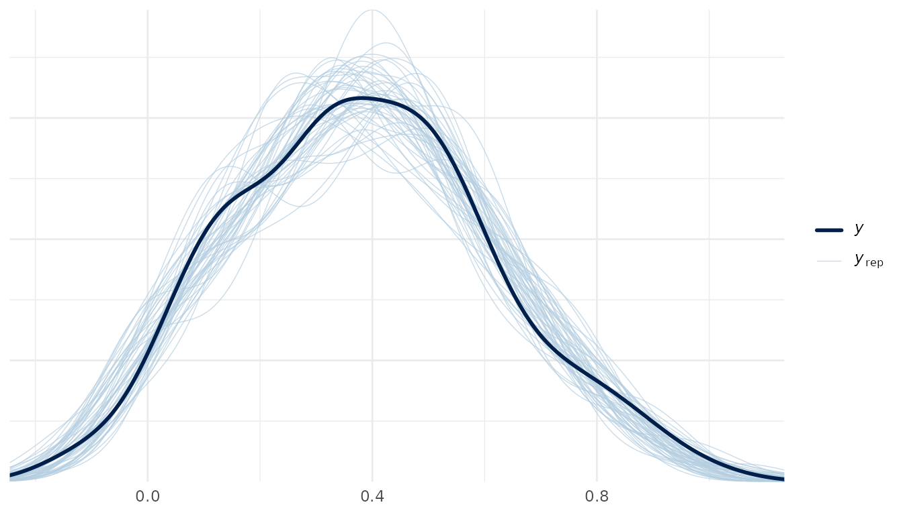
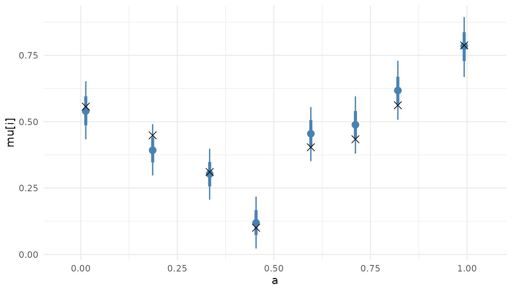

# Working with the posterior

A fit carries its draws, so the established Bayesian tooling takes one
without adaptation: posterior for the draws and their summaries,
bayesplot for the figures, loo for cross-validation and tidybayes for
tidy data frames of draws. Nothing on this page is a method of this
package beyond the generics it registers. Every package used here sits
in `Suggests`, so each chunk is skipped where one is absent; a rendering
with no output below is that, not a failure.

``` r

library(thiessen)
library(posterior)
#> This is posterior version 1.7.0
#> 
#> Attaching package: 'posterior'
#> The following objects are masked from 'package:stats':
#> 
#>     mad, sd, var
#> The following objects are masked from 'package:base':
#> 
#>     %in%, match
library(ggplot2)

set.seed(1)
n <- 150
x <- cbind(a = runif(n), b = runif(n))
y <- 2 * (x[, "a"] - 0.5)^2 + 0.5 * x[, "b"] + rnorm(n, sd = 0.1)

fit <- thiessen(x, y, seed = 1)
```

## The draws

[`as_draws_df()`](https://mc-stan.org/posterior/reference/draws_df.html)
and
[`as_draws_array()`](https://mc-stan.org/posterior/reference/draws_array.html)
return the draws in posterior’s own formats, chains kept separate.

``` r

draws <- as_draws_df(fit)
c(draws = ndraws(draws), chains = nchains(draws))
#>  draws chains 
#>   4000      4
dim(as_draws_array(fit))
#> [1] 1000    4  153
```

The variables are the mean function at each training row, `mu[i]`, the
noise scale `sigma`, and two structural counts: `cell_count`, the mean
cells per tessellation, and `dimension_count`, the mean covariates in
use per tessellation.

``` r

grep("^mu\\[", variables(draws), invert = TRUE, value = TRUE)
#> [1] "sigma"           "cell_count"      "dimension_count"
```

[`summarise_draws()`](https://mc-stan.org/posterior/reference/draws_summary.html)
gives the usual table, R-hat and both effective sample sizes included.

``` r

summarise_draws(subset_draws(draws, variable = c("sigma", "cell_count")))
#> # A tibble: 2 × 10
#>   variable     mean median      sd     mad     q5   q95  rhat ess_bulk ess_tail
#>   <chr>       <dbl>  <dbl>   <dbl>   <dbl>  <dbl> <dbl> <dbl>    <dbl>    <dbl>
#> 1 sigma      0.0972 0.0967 0.00722 0.00692 0.0861 0.110  1.00    1220.    2728.
#> 2 cell_count 3.25   3.25   0.0815  0.0815  3.12   3.39   1.05     121.     255.
```

## Three predictive quantities

The three are distinct and easy to confuse.

- [`posterior_epred()`](https://mc-stan.org/rstantools/reference/posterior_epred.html)
  is the mean function, one row per draw: E\[y \| x\] without
  observation noise.
- [`posterior_predict()`](https://mc-stan.org/rstantools/reference/posterior_predict.html)
  adds the noise, so it draws replicate observations. Under the probit
  family it returns labels.
- [`predictive_interval()`](https://mc-stan.org/rstantools/reference/predictive_interval.html)
  summarises
  [`posterior_predict()`](https://mc-stan.org/rstantools/reference/posterior_predict.html)
  into central intervals, one row per observation.

``` r

dim(posterior_epred(fit, x))
#> [1] 4000  150
dim(posterior_predict(fit, x))
#> [1] 4000  150
head(predictive_interval(fit, newdata = x, prob = 0.9), 3)
#>               5%       95%
#> [1,]  0.26266010 0.6271404
#> [2,]  0.14217255 0.4991563
#> [3,] -0.04175049 0.3137877
```

[`predict()`](https://rdrr.io/r/stats/predict.html) reaches the same
quantities through one argument, and `predict(type = "draws")` is
[`posterior_epred()`](https://mc-stan.org/rstantools/reference/posterior_epred.html).

## bayesplot

bayesplot takes the draws object as it stands. Trace plots of the scalar
variables, one line per chain:

``` r

bayesplot::mcmc_trace(as_draws_array(fit), pars = c("sigma", "cell_count"))
```


A posterior predictive check compares the observed response with
replicates from
[`posterior_predict()`](https://mc-stan.org/rstantools/reference/posterior_predict.html):
the density of `y` over the densities of fifty replicate data sets.

``` r

replicates <- posterior_predict(fit)
bayesplot::ppc_dens_overlay(y, replicates[1:50, ])
```



`mcmc_areas()`, `mcmc_dens()` and `mcmc_intervals()` take the same draws
object for distributional displays.

## Cross-validation with loo

[`log_lik()`](https://mc-stan.org/rstantools/reference/log_lik.html)
returns the pointwise log-likelihood, draws by observations, which is
what [`loo::loo()`](https://mc-stan.org/loo/reference/loo.html) expects.

``` r

log_likelihood <- log_lik(fit)
dim(log_likelihood)
#> [1] 4000  150

estimate <- loo::loo(log_likelihood)
#> Warning: Some Pareto k diagnostic values are too high. See help('pareto-k-diagnostic') for details.
estimate$estimates
#>            Estimate        SE
#> elpd_loo  114.93747  8.799926
#> p_loo      38.12786  3.939812
#> looic    -229.87493 17.599852
```

Read the Pareto k diagnostic before the estimate. The importance
sampling behind PSIS-LOO fails for an observation whose k exceeds 0.7:

``` r

k <- estimate$diagnostics$pareto_k
c(observations = length(k), unreliable = sum(k > 0.7))
#> observations   unreliable 
#>          150            4
```

Where that count is more than a handful, the estimate is not trustworthy
and the answer is more draws, not a different estimator. Two fits are
compared with
[`loo::loo_compare()`](https://mc-stan.org/loo/reference/loo_compare.html)
on their loo objects.

## tidybayes

`tidy_draws()` works on the fit directly, and `spread_draws()` on the
frame it returns, so the draws of `mu[i]` for chosen rows come out as a
long data frame ready for ggplot2.

``` r

tidy <- tidybayes::tidy_draws(fit)
dim(tidy)
#> [1] 4000  156

rows <- order(x[, "a"])[seq(1, n, length.out = 8)]
mu <- tidybayes::spread_draws(tidy, mu[i])
mu <- mu[mu$i %in% rows, ]
head(mu, 3)
#> # A tibble: 3 × 5
#> # Groups:   i [1]
#>       i    mu .chain .iteration .draw
#>   <int> <dbl>  <int>      <int> <int>
#> 1    34 0.379      1          1     1
#> 2    34 0.336      1          2     2
#> 3    34 0.321      1          3     3
```

The posterior of the mean function at those rows, as point and interval
summaries, against the noise-free truth:

``` r

mu$a <- x[mu$i, "a"]
truth <- data.frame(a = x[rows, "a"],
                    f = 2 * (x[rows, "a"] - 0.5)^2 + 0.5 * x[rows, "b"])
ggplot(mu, aes(x = a, y = mu)) +
  tidybayes::stat_pointinterval(colour = "steelblue") +
  geom_point(aes(y = f), data = truth, shape = 4, size = 3) +
  labs(y = "mu[i]")
```



## References

Gabry, J., Simpson, D., Vehtari, A., Betancourt, M. and Gelman, A.
(2019). Visualization in Bayesian workflow. *Journal of the Royal
Statistical Society Series A* 182(2), 389-402. <doi:10.1111/rssa.12378>

Vehtari, A., Gelman, A. and Gabry, J. (2017). Practical Bayesian model
evaluation using leave-one-out cross-validation and WAIC. *Statistics
and Computing* 27(5), 1413-1432. <doi:10.1007/s11222-016-9696-1>

Vehtari, A., Gelman, A., Simpson, D., Carpenter, B. and Buerkner, P.-C.
(2021). Rank-normalization, folding, and localization: an improved R-hat
for assessing convergence of MCMC. *Bayesian Analysis* 16(2), 667-718.
<doi:10.1214/20-BA1221>
