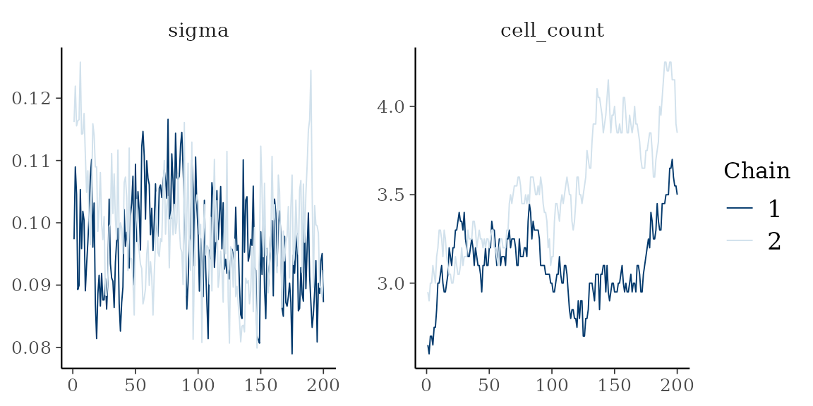

# Working with the posterior

Every package this article uses sits in `Suggests`, so each chunk is
skipped where one of posterior, loo, bayesplot or tidybayes is absent. A
rendering with no output below is that, not a failure.

A fit carries its draws, so the established Bayesian tooling takes one
without adaptation. Nothing here is a method of this package beyond the
generics it registers.

``` r

library(thiessen)
library(posterior)
#> This is posterior version 1.7.0
#> 
#> Attaching package: 'posterior'
#> The following objects are masked from 'package:stats':
#> 
#>     mad, sd, var
#> The following objects are masked from 'package:base':
#> 
#>     %in%, match

set.seed(1)
n <- 120
x <- cbind(runif(n), runif(n))
y <- 2 * (x[, 1] - 0.5)^2 + 0.5 * x[, 2] + rnorm(n, sd = 0.1)
control <- thiessen_control(
  tessellations = 20,
  general_params = general_params(burn_in = 100, draws = 200)
)

fit <- thiessen(x, y, control, chains = 2, seed = 1)
#> Warning in thiessen(x, y, control, chains = 2, seed = 1): The chains may not
#> have converged: largest R-hat 1.318 (threshold 1.01), smallest effective sample
#> size 5 (threshold 400). Run more draws or more chains.
```

The short schedule here never meets the convergence thresholds, so the
fit warns. That is the warning working, not a problem with the code
below.

## The draws

[`as_draws_df()`](https://mc-stan.org/posterior/reference/draws_df.html)
and
[`as_draws_array()`](https://mc-stan.org/posterior/reference/draws_array.html)
return the draws in posterior’s own formats, chains kept separate.

``` r

draws <- as_draws_df(fit)
c(draws = ndraws(draws), chains = nchains(draws))
#>  draws chains 
#>    400      2
dim(as_draws_array(fit))
#> [1] 200   2 123
```

The variables are the mean function at each training row, `mu[i]`, the
noise scale `sigma`, and two structural counts: `cell_count`, the cells
across the ensemble, and `dimension_count`, the covariates in use.

``` r

grep("^mu\\[", variables(draws), invert = TRUE, value = TRUE)
#> [1] "sigma"           "cell_count"      "dimension_count"
```

[`summarise_draws()`](https://mc-stan.org/posterior/reference/draws_summary.html)
gives the usual table, R-hat and both effective sample sizes included.

``` r

summarise_draws(subset_draws(draws, variable = c("sigma", "cell_count")))
#> # A tibble: 2 × 10
#>   variable     mean median      sd     mad     q5   q95  rhat ess_bulk ess_tail
#>   <chr>       <dbl>  <dbl>   <dbl>   <dbl>  <dbl> <dbl> <dbl>    <dbl>    <dbl>
#> 1 sigma      0.0976 0.0968 0.00863 0.00915 0.0850 0.112  1.08    23.5      45.4
#> 2 cell_count 3.32   3.25   0.350   0.297   2.85   4      1.63     3.41     22.1
```

## Three predictive quantities

The three are distinct and easy to confuse.

- [`posterior_epred()`](https://mc-stan.org/rstantools/reference/posterior_epred.html)
  is the mean function, one row per draw: E\[y \| x\] without
  observation noise.
- [`posterior_predict()`](https://mc-stan.org/rstantools/reference/posterior_predict.html)
  adds the noise, so it draws replicate observations. Under the probit
  family it returns labels.
- [`predictive_interval()`](https://mc-stan.org/rstantools/reference/predictive_interval.html)
  summarises
  [`posterior_predict()`](https://mc-stan.org/rstantools/reference/posterior_predict.html)
  into central intervals, one row per observation.

``` r

dim(posterior_epred(fit, x))
#> [1] 400 120
dim(posterior_predict(fit, x))
#> [1] 400 120
head(predictive_interval(fit, newdata = x, prob = 0.9), 3)
#>             5%       95%
#> [1,] 0.3546766 0.7293318
#> [2,] 0.1186428 0.4806989
#> [3,] 0.1004832 0.4639015
```

[`predict()`](https://rdrr.io/r/stats/predict.html) reaches the same
quantities through one argument, and `predict(type = "draws")` is
[`posterior_epred()`](https://mc-stan.org/rstantools/reference/posterior_epred.html).

## Trace plots

bayesplot takes the draws object as it stands.

``` r

bayesplot::mcmc_trace(as_draws_array(fit), pars = c("sigma", "cell_count"))
```



[`thiessen_diagnostics()`](https://l-thomson.github.io/thiessen/r/reference/thiessen_diagnostics.md)
returns the same content as a per-draw data frame for a plot of your
own. It is not for printing: a bare
[`print()`](https://rdrr.io/r/base/print.html) dumps every draw.

## Cross-validation with loo

[`log_lik()`](https://mc-stan.org/rstantools/reference/log_lik.html)
returns the pointwise log-likelihood, draws by observations, which is
what [`loo::loo()`](https://mc-stan.org/loo/reference/loo.html) expects.

``` r

log_likelihood <- log_lik(fit)
dim(log_likelihood)
#> [1] 400 120

estimate <- loo::loo(log_likelihood)
#> Warning: Some Pareto k diagnostic values are too high. See help('pareto-k-diagnostic') for details.
estimate$estimates
#>            Estimate        SE
#> elpd_loo   92.25679  6.964020
#> p_loo      29.66265  3.260829
#> looic    -184.51359 13.928040
```

Read the Pareto k diagnostic before the estimate. The importance
sampling behind PSIS-LOO fails for an observation whose k exceeds 0.7,
and a short schedule on a small data set produces several:

``` r

k <- estimate$diagnostics$pareto_k
c(observations = length(k), unreliable = sum(k > 0.7))
#> observations   unreliable 
#>          120            6
```

Where that count is more than a handful, the estimate is not trustworthy
and the answer is more draws, not a different estimator.

## tidybayes

`tidy_draws()` works on the fit directly, and `spread_draws()` on the
frame it returns.

``` r

tidy <- tidybayes::tidy_draws(fit)
dim(tidy)
#> [1] 400 126

head(tidybayes::spread_draws(tidy, sigma), 3)
#> # A tibble: 3 × 4
#>   .chain .iteration .draw  sigma
#>    <int>      <int> <int>  <dbl>
#> 1      1          1     1 0.0974
#> 2      1          2     2 0.109 
#> 3      1          3     3 0.105
```

## References

Vehtari, A., Gelman, A. and Gabry, J. (2017). Practical Bayesian model
evaluation using leave-one-out cross-validation and WAIC. *Statistics
and Computing* 27(5), 1413-1432. <doi:10.1007/s11222-016-9696-1>

Vehtari, A., Gelman, A., Simpson, D., Carpenter, B. and Buerkner, P.-C.
(2021). Rank-normalization, folding, and localization: an improved R-hat
for assessing convergence of MCMC. *Bayesian Analysis* 16(2), 667-718.
<doi:10.1214/20-BA1221>
