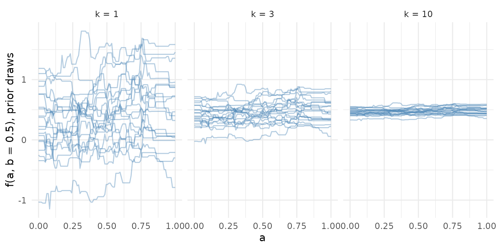
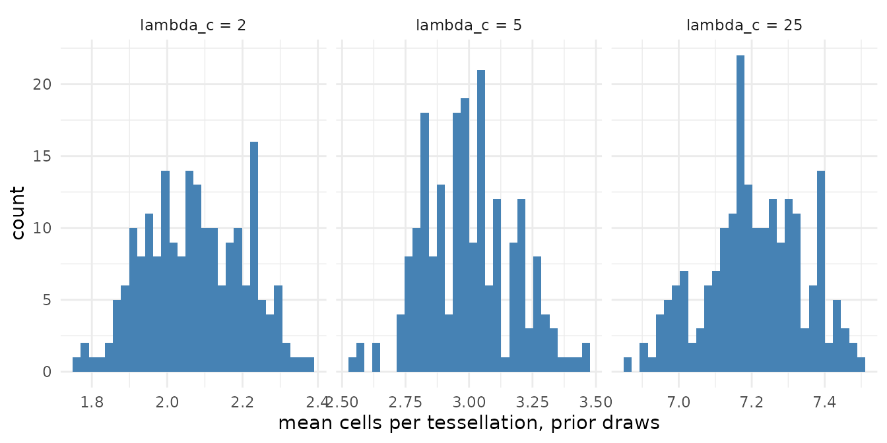
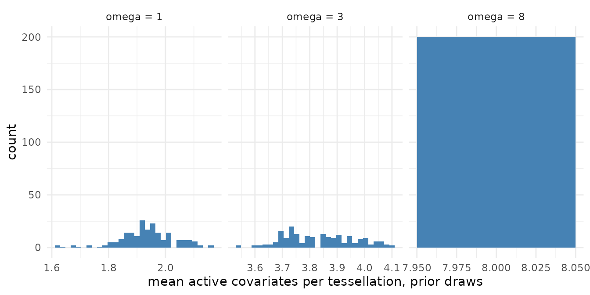

# Priors and what they do

The priors are those of Stone and Gosling (2025), and the defaults are
the published ones, so most fits change none of them. This page draws
from the prior at three settings of each of the three that shape a fit
most, so you can see what a setting does before you change it. The
[model
description](https://l-thomson.github.io/thiessen/r/articles/model-description.md)
page states every prior; the [control
surface](https://l-thomson.github.io/thiessen/r/articles/control-surface.md)
page says where each argument lives.

`general_params(prior_only = TRUE)` switches the likelihood off, so the
chain draws from the prior alone. The response is still passed: the
priors are stated on the response scaled to \[-0.5, 0.5\] over its
range, and the draws come back on the original scale.

``` r

library(thiessen)
library(ggplot2)

set.seed(1)
n <- 100
x <- cbind(a = runif(n), b = runif(n))
y <- 2 * (x[, "a"] - 0.5)^2 + 0.5 * x[, "b"] + rnorm(n, sd = 0.1)
grid <- cbind(a = seq(0, 1, length.out = 100), b = 0.5)

prior_draws <- function(setting, ...) {
  control <- thiessen_control(
    tessellations = 50,
    general_params = general_params(burn_in = 1000, draws = 200,
                                    prior_only = TRUE),
    ...
  )
  thiessen(x, y, control, seed = 1, chains = 1)
}
```

## k: how far the mean function can move

Each cell value has prior N(0, sigma_mu^2) with sigma_mu = 0.5 / (k
sqrt(m)), so the sum of m tessellations has prior standard deviation 0.5
/ k on the scaled response. A larger k shrinks every cell towards zero
and the ensemble towards its centre; the default k = 3 puts most of the
prior mass of f(x) across the range of the data. Twenty prior draws of f
along `a` at three values of k:

``` r

draws_of_f <- function(k) {
  fit <- prior_draws(mean_params = term_params(k = k))
  f <- predict(fit, grid, type = "draws")[1:20, ]
  data.frame(k = paste("k =", k), draw = rep(1:20, each = ncol(f)),
             a = rep(grid[, "a"], times = 20), f = as.vector(t(f)))
}
prior_f <- do.call(rbind, lapply(c(1, 3, 10), draws_of_f))
prior_f$k <- factor(prior_f$k, levels = c("k = 1", "k = 3", "k = 10"))

ggplot(prior_f, aes(a, f, group = draw)) +
  geom_line(alpha = 0.4, colour = "steelblue") +
  facet_wrap(~k) +
  labs(y = "f(a, b = 0.5), prior draws")
```



## lambda_c: how many cells a tessellation has

The number of cells in a tessellation, less one, has prior
Poisson(lambda_c). The default of 5 follows CRAN AddiVortes 0.6.8 and
later; the paper reports 25. More cells per tessellation make each
tessellation a finer partition, and cost proportionally more per sweep.
The prior enters through the moves that add and remove a centre, and a
proposal that leaves a cell with no training row in it is rejected, so
what the sampler draws from is the Poisson conditioned on every cell
being occupied: over a hundred rows a tessellation rarely holds the 26
cells lambda_c = 25 names, and the realised counts sit well below 1 +
lambda_c. The histograms below are of the mean count over the fifty
tessellations, per draw, so they are narrower than the count of one
tessellation:

``` r

cells <- function(lambda_c) {
  fit <- prior_draws(mean_params = term_params(lambda_c = lambda_c))
  data.frame(lambda_c = paste("lambda_c =", lambda_c),
             cell_count = thiessen_diagnostics(fit)$cell_count)
}
prior_cells <- do.call(rbind, lapply(c(2, 5, 25), cells))
prior_cells$lambda_c <- factor(prior_cells$lambda_c,
                               levels = unique(prior_cells$lambda_c))

ggplot(prior_cells, aes(cell_count)) +
  geom_histogram(bins = 30, fill = "steelblue") +
  facet_wrap(~lambda_c, scales = "free_x") +
  labs(x = "mean cells per tessellation, prior draws")
```



## omega: how many covariates a tessellation uses

The number of active covariates in a tessellation, less one, has prior
Binomial(p - 1, omega / p), so omega is the prior mean number of
covariates each tessellation uses. The default resolves to min(3, p) at
fit: with three covariates or fewer every tessellation uses all of them,
and the count cannot move. With eight covariates, the prior distribution
of the mean active covariates per tessellation at three values of omega:

``` r

x8 <- cbind(x, matrix(runif(6 * n), n, 6))
dimensions <- function(omega) {
  control <- thiessen_control(
    tessellations = 50,
    general_params = general_params(burn_in = 1000, draws = 200,
                                    prior_only = TRUE),
    mean_params = term_params(structure = structure_params(omega = omega))
  )
  fit <- thiessen(x8, y, control, seed = 1, chains = 1)
  data.frame(omega = paste("omega =", omega),
             dimension_count = thiessen_diagnostics(fit)$dimension_count)
}
prior_dimensions <- do.call(rbind, lapply(c(1, 3, 8), dimensions))
prior_dimensions$omega <- factor(prior_dimensions$omega,
                                 levels = unique(prior_dimensions$omega))

ggplot(prior_dimensions, aes(dimension_count)) +
  geom_histogram(bins = 30, fill = "steelblue") +
  facet_wrap(~omega, scales = "free_x") +
  labs(x = "mean active covariates per tessellation, prior draws")
```



## The noise prior

`gaussian_outcome(nu, q)` sets the prior on sigma^2, nu lambda /
chi^2_nu, with lambda chosen so that a proportion q of the prior mass of
sigma lies below sigma_hat, the residual standard deviation of a
least-squares fit to the data. The defaults nu = 6 and q = 0.85 are
BART’s `sigdf` and `sigquant`. A larger q says the noise is likely
smaller than a linear fit’s residuals, which is the usual case for a
nonlinear regression; a smaller nu widens the prior.

## References

Chipman, H. A., George, E. I. and McCulloch, R. E. (2010). BART:
Bayesian additive regression trees. *The Annals of Applied Statistics*
4(1), 266-298. <doi:10.1214/09-AOAS285>

Stone, A. and Gosling, J. P. (2025). AddiVortes: (Bayesian) additive
Voronoi tessellations. *Journal of Computational and Graphical
Statistics* 34(3), 859-871. <doi:10.1080/10618600.2024.2414104>
