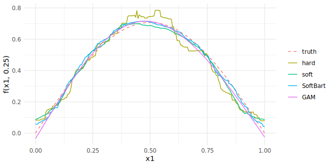
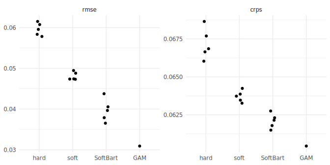
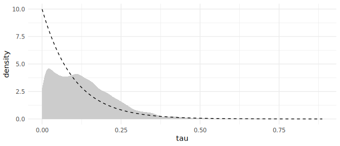
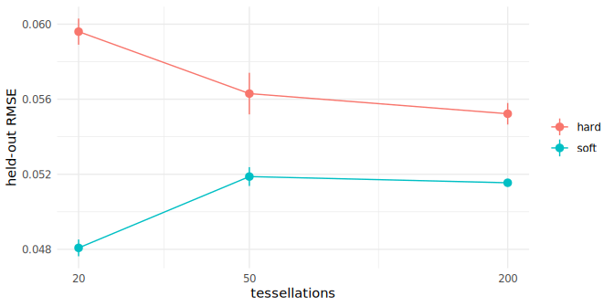
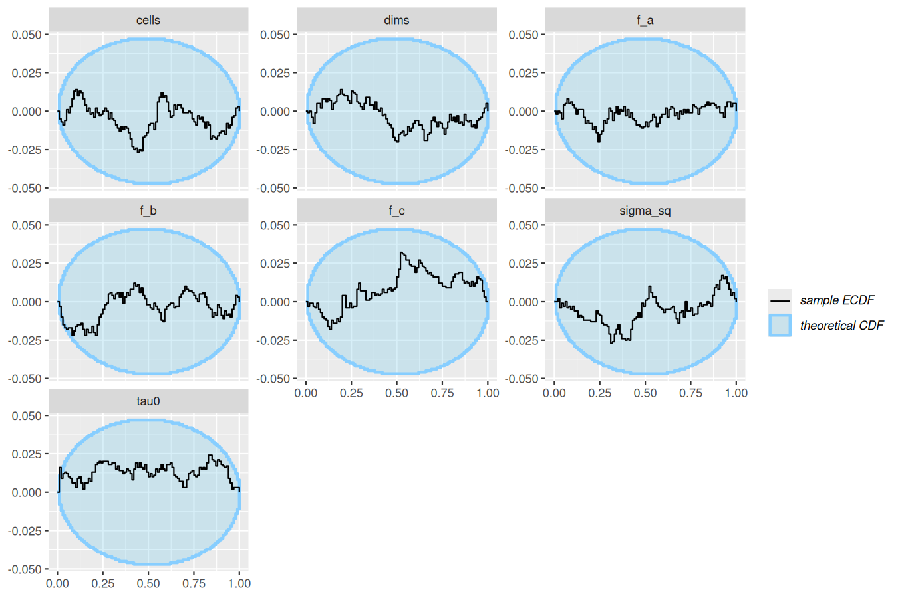
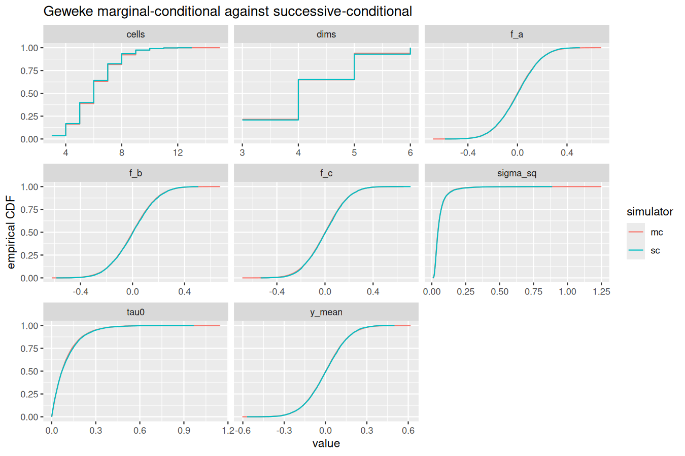

[](https://lifecycle.r-lib.org/articles/stages.html#experimental)

Needs a build made with `THIESSEN_EXPERIMENTAL=1 R CMD INSTALL r`; the
[experimental](experimental.html) page has the catalogue and the rule.

## Introduction

Under the published model an observation belongs to the cell whose
centre is nearest, so each tessellation is a piecewise-constant
function with a step at every cell boundary. Soft membership replaces
that rule: an observation belongs to every cell, with a weight that
falls off with its distance to each centre under a per-tessellation
bandwidth tau, and the tessellation's value is the weighted mean of its
cell values. As tau falls to 0 the hard rule returns. This is the
Voronoi analogue of soft BART (Linero and Yang 2018), where the kernel
acts on the distance to each centre rather than on a chain of split
gates. Reach for it when the truth is smooth and the ensemble is small,
the setting soft BART was built for.

Prerequisite: BART (Chipman, George and McCulloch 2010) and AddiVortes
(Stone and Gosling 2025). The [model description](../model-description.html)
page has the notation.

## The model

    w_k(x) proportional to exp(-d_k^2(x) / (2 tau^2)),   sum_k w_k(x) = 1
    g(x; T, M) = sum_k w_k(x) mu_k
    tau ~ Exponential(rate),   rate = 10 by default

with d_k^2(x) the squared distance from x to centre k over the
tessellation's active covariates, the same quantity the hard rule
minimises, and tau a bandwidth on the scaled covariate space, so the
prior mean bandwidth is a tenth of a column's range (the SoftBart
`tau_rate` default). The cell values are drawn jointly from their
conjugate normal, the structural moves integrate them out, and tau
moves by a Metropolis step on its logarithm. The statement in full is
the "Soft membership" section of
[`docs/models.md`](https://github.com/l-thomson/thiessen/blob/dev/docs/models.md)
and the derivation note is
[`crates/thiessen/src/cells.rs`](https://github.com/l-thomson/thiessen/blob/dev/crates/thiessen/src/cells.rs).
Constant cell basis and constant spread only.

## Example

The surface is sin(pi x1) cos(pi x2) on the unit square, observed with
noise of standard deviation 0.1 at 300 rows, with 500 held-out rows and
their noise-free values. The ensemble has 20 tessellations, small
enough that the steps of the hard rule are visible, and the schedule of
300 burn-in and 300 kept sweeps on four chains. The two rules are fitted
at the same five seeds.


``` r
source("_setup.R")
```


``` r
data <- smooth_surface(n = 300, sd = 0.1, seed = 1)
hard <- thiessen_control(tessellations = 20, general_params = schedule)
soft <- thiessen_control(
  tessellations = 20, general_params = schedule,
  mean_params = term_params(geometry = geometry_params(membership = soft_membership()))
)
fits <- paired_fits(data, list(hard = hard, soft = soft), seeds)
#> Warning in thiessen(data$train$x, data$train$y, control, seed = seed): The
#> chains may not have converged: largest R-hat 2.046 (threshold 1.01), smallest
#> effective sample size 6 (threshold 400). Run more draws or more chains.
#> Warning in thiessen(data$train$x, data$train$y, control, seed = seed): The
#> chains may not have converged: largest R-hat 1.831 (threshold 1.01), smallest
#> effective sample size 6 (threshold 400). Run more draws or more chains.
#> Warning in thiessen(data$train$x, data$train$y, control, seed = seed): The
#> chains may not have converged: largest R-hat 1.621 (threshold 1.01), smallest
#> effective sample size 7 (threshold 400). Run more draws or more chains.
#> Warning in thiessen(data$train$x, data$train$y, control, seed = seed): The
#> chains may not have converged: largest R-hat 1.510 (threshold 1.01), smallest
#> effective sample size 7 (threshold 400). Run more draws or more chains.
#> Warning in thiessen(data$train$x, data$train$y, control, seed = seed): The
#> chains may not have converged: largest R-hat 2.250 (threshold 1.01), smallest
#> effective sample size 5 (threshold 400). Run more draws or more chains.
#> Warning in thiessen(data$train$x, data$train$y, control, seed = seed): The
#> chains may not have converged: largest R-hat 1.428 (threshold 1.01), smallest
#> effective sample size 9 (threshold 400). Run more draws or more chains.
#> Warning in thiessen(data$train$x, data$train$y, control, seed = seed): The
#> chains may not have converged: largest R-hat 1.483 (threshold 1.01), smallest
#> effective sample size 8 (threshold 400). Run more draws or more chains.
#> Warning in thiessen(data$train$x, data$train$y, control, seed = seed): The
#> chains may not have converged: largest R-hat 1.321 (threshold 1.01), smallest
#> effective sample size 10 (threshold 400). Run more draws or more chains.
#> Warning in thiessen(data$train$x, data$train$y, control, seed = seed): The
#> chains may not have converged: largest R-hat 1.516 (threshold 1.01), smallest
#> effective sample size 8 (threshold 400). Run more draws or more chains.
#> Warning in thiessen(data$train$x, data$train$y, control, seed = seed): The
#> chains may not have converged: largest R-hat 1.400 (threshold 1.01), smallest
#> effective sample size 9 (threshold 400). Run more draws or more chains.
summary(fits$soft[[1]])
#> AddiVortes fit
#> Call: thiessen(x = data$train$x, y = data$train$y, control = control,      seed = seed)
#> gaussian model, 300 observations, 2 covariates
#> 20 tessellations, 1200 draws kept after 300 burn-in, thinning 1
#> 
#> Residuals:
#>          2.5%           25%           50%           75%         97.5% 
#> -0.1597108575 -0.0582881531 -0.0001191953  0.0599379543  0.1735278177 
#> 
#> sigma:
#>       2.5%        25%        50%        75%      97.5% 
#> 0.09294550 0.09847516 0.10187852 0.10536875 0.11225547 
#> 
#> In-sample RMSE 0.08874
#> 4 chains, largest R-hat 1.428, smallest effective sample size 9
#> Warning: The chains may not have converged: largest R-hat 1.428 (threshold 1.01), smallest effective sample size 9 (threshold 400). Run more draws or more chains.
```

The check fails, and it fails for the hard rule too. With twenty
tessellations of a few cells each, the four chains settle on different
partitions of the square, and the mean at a training row differs
between chains by a step; R-hat on `mu[i]` reports that. A schedule
seven times longer narrows the gap for the soft rule and leaves the
hard rule where it was:


``` r
long <- general_params(burn_in = 2000, draws = 2000)
largest_rhat <- function(control) {
  fit <- thiessen(data$train$x, data$train$y, control, seed = 1)
  fit$convergence$rhat
}
c(hard = largest_rhat(thiessen_control(tessellations = 20, general_params = long)),
  soft = largest_rhat(thiessen_control(tessellations = 20, general_params = long,
    mean_params = term_params(geometry = geometry_params(membership = soft_membership())))))
#> Warning in thiessen(data$train$x, data$train$y, control, seed = 1): The chains
#> may not have converged: largest R-hat 1.795 (threshold 1.01), smallest
#> effective sample size 6 (threshold 400). Run more draws or more chains.
#> Warning in thiessen(data$train$x, data$train$y, control, seed = 1): The chains
#> may not have converged: largest R-hat 1.119 (threshold 1.01), smallest
#> effective sample size 23 (threshold 400). Run more draws or more chains.
#>     hard     soft 
#> 1.795427 1.118882
```

The held-out error does not depend on which partition a chain found,
as the standard errors over seeds below show, and the boundary figure
reports the check against the ensemble size.

The comparators are the two methods a reader would reach for on a
smooth surface. SoftBart (Linero and Yang 2018) is the tree ensemble
this rule adapts, fitted with 20 trees on the same schedule, one chain
per seed; its bandwidth prior is the one used here. `mgcv::gam()` with
a tensor-product smooth is the standard smoother, fitted once, since it
has no chain to seed.


``` r
library(SoftBart)
library(mgcv)
frame <- data.frame(data$train$x, y = data$train$y)
softbart <- lapply(seeds, function(seed) {
  set.seed(seed)
  softbart_regression(y ~ x1 + x2, frame, frame, num_tree = 20,
                      opts = Opts(num_burn = 300, num_save = 300), verbose = FALSE)
})
gam <- gam(y ~ te(x1, x2), data = frame)
```

Every method is scored on the same 500 held-out rows through its
predictive distribution: the root mean squared error of the posterior
mean against the noise-free truth, the coverage and mean width of the
central 95 per cent predictive interval, the CRPS (lower is better)
and the log score (higher is better) of the held-out response, both
exact for the predictive mixture (Jordan, Krueger and Lerch 2019). The
mean over the five seeds with its standard error in parentheses:


``` r
scores <- score(c(fits, list(SoftBart = softbart, GAM = list(gam))), data)
knitr::kable(score_table(scores))
```


|model    |RMSE          |coverage      |width         |CRPS          |log score     |
|:--------|:-------------|:-------------|:-------------|:-------------|:-------------|
|hard     |0.060 (0.001) |0.962 (0.004) |0.506 (0.002) |0.067 (0.000) |0.696 (0.007) |
|soft     |0.048 (0.000) |0.954 (0.002) |0.456 (0.001) |0.064 (0.000) |0.759 (0.003) |
|SoftBart |0.040 (0.001) |0.960 (0.003) |0.456 (0.004) |0.062 (0.000) |0.781 (0.003) |
|GAM      |0.031         |0.954         |0.422         |0.060         |0.810         |


## What it shows

Figure 1, the mechanism: a transect of the surface at x2 = 0.25, the
truth beside the posterior mean of each method at seed 1. The hard
rule is a staircase; the soft rule, at the same ensemble size, is not.


``` r
grid <- cbind(x1 = seq(0, 1, length.out = 200), x2 = 0.25)
methods <- list(hard = fits$hard[[1]], soft = fits$soft[[1]],
                SoftBart = softbart[[1]], GAM = gam)
curves <- vapply(methods, function(fit) colMeans(predictive(fit, grid)$mean), numeric(nrow(grid)))
transect <- data.frame(
  x1 = grid[, "x1"],
  method = factor(rep(c("truth", names(methods)), each = nrow(grid)), c("truth", names(methods))),
  f = c(surface_f(grid), curves)
)
ggplot(transect, aes(x1, f, colour = method, linetype = method)) +
  geom_line() +
  scale_linetype_manual(values = c("dashed", rep("solid", 4))) +
  labs(y = "f(x1, 0.25)", colour = NULL, linetype = NULL)
```

<div class="figure">

<p class="caption">Figure 1. The surface along x2 = 0.25: the truth and the posterior mean of each method at seed 1.</p>
</div>

Figure 2, the comparison: the error and the CRPS of every fit, one
point per seed, so the gap between the rules is read against the
spread over seeds.


``` r
ggplot(subset(scores, metric %in% c("rmse", "crps")), aes(model, value)) +
  geom_point(position = position_jitter(width = 0.1, height = 0, seed = 1)) +
  facet_wrap(~ metric, scales = "free_y") +
  labs(x = NULL, y = NULL)
```

<div class="figure">

<p class="caption">Figure 2. Held-out RMSE and CRPS of every fit, one point per seed.</p>
</div>

The bandwidth the data chose, against its prior. `bandwidth[j]` is the
bandwidth of tessellation j, and the tessellations are exchangeable, so
the draws are pooled over j and over the chains.


``` r
draws <- posterior::subset_draws(posterior::as_draws_df(fits$soft[[1]]), variable = "bandwidth")
bandwidth <- as.vector(posterior::as_draws_matrix(draws))
ggplot(data.frame(bandwidth), aes(bandwidth)) +
  geom_density(fill = "grey80", colour = NA) +
  stat_function(fun = dexp, args = list(rate = 10), linetype = "dashed") +
  labs(x = "tau", y = "density")
```

<div class="figure">

<p class="caption">The pooled posterior of the bandwidth tau in the soft fit at seed 1 (grey) against its Exponential(10) prior (dashed).</p>
</div>

Figure 3, the boundary: the same two rules at 20, 50 and 200
tessellations, five seeds each, the fits at 20 being the ones above.
The gap narrows as the hard ensemble gets the cells it needs, and the
soft rule's own error is lowest at the smallest size. Every one of
these fits warns as the fits above did; the table carries the largest
R-hat over the five seeds at each size in place of the thirty warnings,
and it falls with the ensemble size for both rules.


``` r
sizes <- c(20, 50, 200)
by_size <- c(list(fits), lapply(sizes[-1], function(m) paired_fits(data, list(
  hard = thiessen_control(tessellations = m, general_params = schedule),
  soft = thiessen_control(tessellations = m, general_params = schedule,
    mean_params = term_params(geometry = geometry_params(membership = soft_membership())))
), seeds)))
boundary <- do.call(rbind, lapply(seq_along(sizes), function(i) {
  do.call(rbind, lapply(c("hard", "soft"), function(rule) {
    errors <- sapply(by_size[[i]][[rule]], rmse, data = data)
    data.frame(tessellations = sizes[i], rule = rule,
               RMSE = mean(errors), SE = sd(errors) / sqrt(length(errors)),
               `largest R-hat` = max(sapply(by_size[[i]][[rule]], function(fit) fit$convergence$rhat)),
               check.names = FALSE)
  }))
}))
knitr::kable(boundary, digits = 3)
```


| tessellations|rule |  RMSE|    SE| largest R-hat|
|-------------:|:----|-----:|-----:|-------------:|
|            20|hard | 0.060| 0.001|         2.250|
|            20|soft | 0.048| 0.000|         1.516|
|            50|hard | 0.056| 0.001|         1.463|
|            50|soft | 0.052| 0.001|         1.345|
|           200|hard | 0.055| 0.001|         1.114|
|           200|soft | 0.052| 0.000|         1.061|


``` r
ggplot(boundary, aes(tessellations, RMSE, colour = rule)) +
  geom_line() +
  geom_pointrange(aes(ymin = RMSE - SE, ymax = RMSE + SE)) +
  scale_x_log10(breaks = sizes) +
  labs(x = "tessellations", y = "held-out RMSE", colour = NULL)
```

<div class="figure">

<p class="caption">Figure 3. Held-out RMSE against the ensemble size, the mean and standard error over five seeds.</p>
</div>

## Validity

Validation is the calibration battery in the core's test suite; this
page is illustration. The soft rule carries known-answer tests of the
marginal likelihood and of the joint cell draw against quadrature,
simulation-based calibration and Geweke tests at two sizes, and a
broken-sampler fixture that drops the determinant term from the
integrated likelihood, which the gates reject. The figures are the
SBC rank-ECDF difference and the Geweke ECDF from the nightly run
named below.

Nightly run 33073537519, stem `soft`.
SBC: 1000 simulations, 99 posterior draws each, quantities sigma_sq, cells, dims, f_a, f_b, f_c, tau0.
Geweke: 20000 samples per simulator, quantities sigma_sq, cells, dims, f_a, f_b, f_c, tau0, y_mean.





## Limits

The kernel acts on the distance to each centre; the smoothness and
adaptation results of Linero and Yang (2018) are for gated splits and
have not been carried to this kernel. The Exponential prior on tau and
its rate are taken from SoftBart with no Voronoi-specific argument, and
the interaction between tau and the centre scale sigma_c is unstudied.
The empty-cell rule still counts nearest-centre members. The linear
cell basis has no weighted update and the variance ensemble's
inverse-gamma cells have no closed-form weighted conditional, so both
compositions are rejected at validation.

## References

Chipman, H. A., George, E. I. and McCulloch, R. E. (2010). BART:
Bayesian additive regression trees. *The Annals of Applied Statistics*
4(1), 266-298. doi:10.1214/09-AOAS285

Jordan, A., Krueger, F. and Lerch, S. (2019). Evaluating probabilistic
forecasts with scoringRules. *Journal of Statistical Software* 90(12),
1-37. doi:10.18637/jss.v090.i12

Linero, A. R. and Yang, Y. (2018). Bayesian regression tree ensembles
that adapt to smoothness and sparsity. *Journal of the Royal
Statistical Society Series B* 80(5), 1087-1110. doi:10.1111/rssb.12293

Stone, A. and Gosling, J. P. (2025). AddiVortes: (Bayesian) additive
Voronoi tessellations. *Journal of Computational and Graphical
Statistics* 34(3), 859-871. doi:10.1080/10618600.2024.2414104

Wood, S. N. (2017). *Generalized Additive Models: An Introduction with
R*, second edition. Chapman and Hall/CRC.
